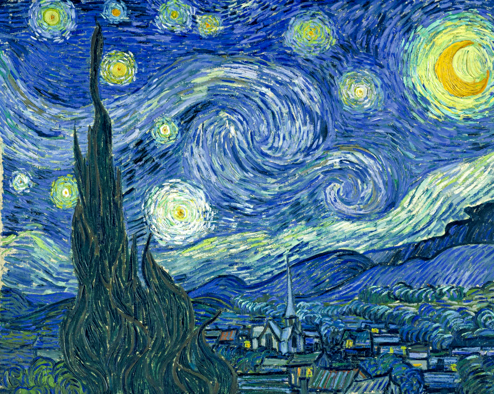

# Neural Style Transfer App


## Overview

This repository contains a Streamlit web application that implements Neural Style Transfer (NST), a technique that allows you to combine the content of one image with the style of another image. The implementation is based on the work of Leon Gatys et al. as described in their paper ["A Neural Algorithm of Artistic Style"](https://arxiv.org/abs/1508.06576).

## What is Neural Style Transfer?

Neural Style Transfer is a technique that uses convolutional neural networks to separate and recombine the content and style of arbitrary images. The algorithm works by:

1. Using a pre-trained CNN (VGG19) to extract content features from a content image
2. Extracting style features (via Gram matrices) from a style image
3. Iteratively optimizing a new image to match both the content features of the content image and the style features of the style image

The result is a new image that preserves the structural content of one image while adopting the artistic style of another.

## Examples

Here are examples of what this app can do:

| Content Image | Style Image | Result |
|:-------------:|:-----------:|:------:|
|  |  |  |

## Features

- User-friendly web interface built with Streamlit
- Support for uploading custom content and style images
- Option to choose between low-resolution (faster) and high-resolution (slower) processing
- Real-time preview of uploaded images
- Progress tracking during the style transfer process

## Installation

### Prerequisites

- Python 3.7 or later
- PyTorch
- CUDA-capable GPU (recommended for faster processing)

### Clone the Repository

```bash
git clone https://github.com/yourusername/neural-style-transfer-app.git
cd neural-style-transfer-app
```

### Install Dependencies

```bash
pip install -r requirements.txt
```

The requirements.txt file should include:

```
torch
torchvision
streamlit
pillow
requests
```

## Usage

### Running the Streamlit App

```bash
streamlit run app.py
```

After running the command, your web browser should automatically open with the app running at `http://localhost:8501`.

### Using the App

1. Upload a content image (the structure you want to preserve)
2. Upload a style image (the artistic style you want to apply)
3. Choose between low or high resolution output
4. Click the "Stylize!" button to begin the process
5. Wait for the algorithm to complete (this may take several minutes)
6. View and download the stylized result

## Implementation Details

The core style transfer algorithm is implemented in `style_transfer.py`, which uses:

- VGG19 pre-trained network for feature extraction
- L-BFGS optimizer for image transformation
- Gram matrix computation for style representation
- Multi-resolution approach for higher quality results

## Acknowledgements

This implementation is based on the Neural Style Transfer technique introduced by:

- Leon A. Gatys, Alexander S. Ecker, and Matthias Bethge in their paper ["A Neural Algorithm of Artistic Style"](https://arxiv.org/abs/1508.06576) (2015)

## License

[MIT License](LICENSE)

## Contributing

Contributions, issues, and feature requests are welcome! Feel free to check the [issues page](https://github.com/yourusername/neural-style-transfer-app/issues).